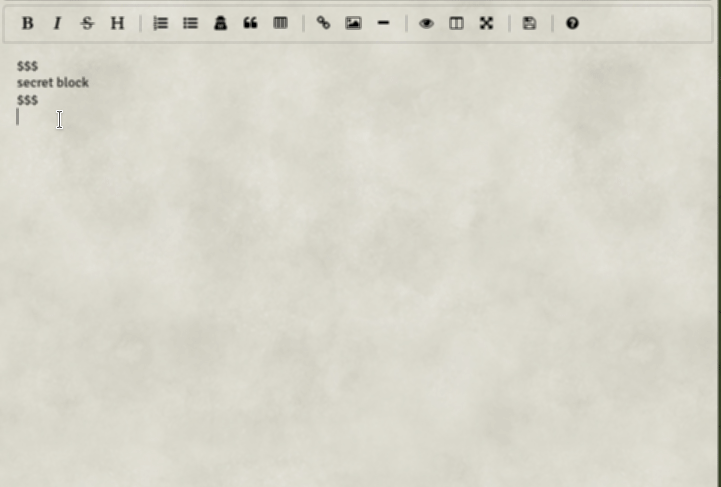

# Meme - Moerrils Efficacious Markdown Editor [BETA] <!-- omit in toc -->
    [](https://www.paypal.com/cgi-bin/webscr?cmd=_s-xclick&hosted_button_id=FYZ294SP2JBGS&source=url)

This is a drop in replacement for FVTTs default rich text editor (TinyMCE).  
While switching between the original editor and this one does not result in bugs, it will behave like so:
* Content created through TinyMCE will be displayed correctly in the markdown editor, when previewing. While editing you will see the original HTML.
* Markdown written through the markdown editor will not be parsed to the correct HTML output, when switching back to the default editor, TinyMCE. But it will not cause problems.

- [Important Information!](#important-information)
	- [Beta Version](#beta-version)
	- [Style problems? System/sheet/.. not supported?](#style-problems-systemsheet-not-supported)
	- [Bug Reporting](#bug-reporting)
	- [Atribution](#atribution)
	- [Licensing](#licensing)
	- [Support the development](#support-the-development)
- [Features](#features)
	- [Enhanced Markdown Syntax](#enhanced-markdown-syntax)
	- [Keyboard shortcuts](#keyboard-shortcuts)
	- [Entity Link Autocompletion](#entity-link-autocompletion)
	- [VIM Keybindings](#vim-keybindings)

# Important Information!
## Beta Version
This module is Beta. I do feel quite confident that it does work and doesn't break stuff, but please still be careful.  
*Also this means: I'm in big need of feedback! Tell me what is awesome, what doesn't work and/or what you'd like to improve upon!*

## Style problems? System/sheet/.. not supported?
If your system/sheet/... has some styling issues with this editor, please contact me aboutb it and **ideally** send me the css to fix it! I'll be happy to incorporate it. But i can't check every module or system myself, there are to many.

## Bug Reporting
Go to the [GitHub's issue board](https://github.com/Moerill/fvtt-markdown-editor/issues) and check if the Bug is already reported. If not first test with all other modules disabled! If the bug persists create a new issue, with at least the following information:
1. Module version
2. FVTT version
3. Browser and OS used. Or if the app itself is used.
4. Bug description
	- What happened?
	- What should've happened?
	- Console errors? (F12 or F11 in most browsers)
5. Workflow to recreate the bug
6. Helpful videos or screenshots if possible
7. Either activate notifications, stay active or post your discord handle so i can get back to you for further questions  

**I will only take a quick glance at half hearted bug reports or Discord mentions! Don't expect me to react there!**

## Atribution
This module uses and partially modifies the following libraries:
* [EasyMDE](https://github.com/Ionaru/easy-markdown-editor)
* [Marked](https://github.com/markedjs/marked)  
* [Codemirror](https://codemirror.net/)
  
Thanks to @NickEast for his  which i'm using in a modified version for my building and publishing workflow.

This module would not be possible without the great work from Atropos on FoundryVTT and the [DnD5e System](https://gitlab.com/foundrynet/dnd5e) for FoundryVTT! Part of the code (especially the code for the rolls) is heavily based on the DnD5es code, which is licensed under GNU GPLv3.

## Licensing
This module currently is not licensed itself.

This work is licensed under Foundry Virtual Tabletop [EULA - Limited License Agreement for module development](https://foundryvtt.com/article/license/).

## Support the development
Want to help me develop? Send a merge request on this gitlab or contact me on Discord (Moerill#7205).  
Want to support me in another way? 
Leave me some nice comments (e.g. on Discord), recommend this module to others and/or leave a donation over at my [PayPal](https://www.paypal.com/cgi-bin/webscr?cmd=_s-xclick&hosted_button_id=FYZ294SP2JBGS&source=url).

# Features
## Enhanced Markdown Syntax
List of extra markdown Syntax
- FVTT style secret blocks using ``$$$`` at the start and end of a block, like:
  ```
	$$$
	secret 
	block
	$$$
	```

## Keyboard shortcuts

Shortcut (Windows / Linux) | Shortcut (macOS) | Action
:--- | :--- | :---
*Ctrl-B* | *Cmd-B* | toggle bold
*Ctrl-I* | *Cmd-I* | toggle italic
*Ctrl-H* | *Cmd-H* | toggle header size (big to small)
*Shift-Ctrl-H* | *Shift-Cmd-H* | toggle header size (small to big)
*Ctrl-'* | *Cmd-'* | toggle blockquote
*Ctrl-Alt-C* | *Cmd-Alt-C* | toggle code block
*Ctrl-Alt-L* | *Cmd-Alt-L* | toggle ordered list
*Ctrl-L* | *Cmd-L* | toggle unordered list
*Ctrl-K* | *Cmd-K* | add link template
*Ctrl-Alt-I* | *Cmd-Alt-I* | add image template
*Ctrl-P* | *Cmd-P* | toggle preview
*F9* | *F9* | toggle side by side view
*F11* | *F11* | toggle full screen view

## Entity Link Autocompletion

Autocompletes your Entity links and replacing the name using the ID. Just write an ``@`` and it will the entity type. When the entity type was chosen it will supply a list of all world entities of that type.  
Compendia are currently not supported, but will come with a future update.  

## VIM Keybindings
You can enable VIM Keybindings for the editor, inside FVTTs Settings menu. This setting is user specific.